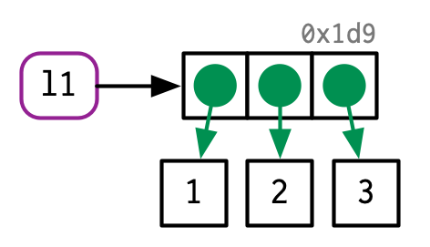

# Names and values {#names-values}

```{r, include = FALSE}
source("common.R")
```


## Introduction

R에서는 객체(object)와 이름(name)의 차이를 이해하는 것이 중요합니다. 이를 이해하게 된다면,

* 더 정확하게 코드의 성능과 메모리 사용을 예측할 수 있습니다.
* 느린 코드의 주요 원인인 의도치 않은 복사를 피함으로써, 빠른 코드를 작성할 수 있습니다.
* R의 함수형 프로그래밍 툴에 대해 더욱 잘 이해할 수 있게 됩니다.

이 챕터의 목표는 이름(names)과 값(values)의 차이, 그리고 언제 R이 객체(object)를 복사하는지 이해하도록 돕는 것입니다.


### Quiz {-}

이 챕터를 넘겨도 될지 다음 문제를 통해 확인해보세요. 이 챕터 끝에 있는 Section 2.7에서 정답을 확인하실 수 있습니다.

1. 주어진 데이터프레임에서, 어떻게 하면 `1`과 `2`의 합을 담고 있는 "3"이라는 열을 만들 수 있을까요? `[[`는 사용하지 말고, `$`만 이용해보세요. `1`, `2`, 그리고 `3`을 변수명으로 사용하기 어렵게 만드는 것은 무엇인가요?

```{r}
df <- data.frame(runif(3), runif(3))
names(df) <- c(1, 2)
```

2. 주어진 코드에서, `y`가 차지하는 메모리는 얼마만큼인가요?

```{r}
x <- runif(1e6)
y <- list(x, x, x)
```

3. 주어진 예시에서 `a`가 복사되는 순간은 몇번째 줄일까요?

```{r}
a <- c(1, 5, 3, 2)
b <- a
b[[1]] <- 10
```


### Outline {-}

* Section 2.2는 이름(names)와 값(values)의 차이점을 소개하고, `<-`가 어떻게 이름과 값 사이의 연결(binding)이나 참조(reference)를 만들어내는지 다룹니다.

* Section 2.3은 R이 언제 '복사'를 실행하는지 설명합니다. 벡터를 변형시킬때라면, 거의 대부분 새로운 변형된 벡터를 생성하는 것이라 볼 수 있습니다. `tracemem()` 을 사용해 언제 복사가 실제로 일어나는지 확인하는 법을 배웁니다. 그리고 이것들이 함수 실행, 리스트, 데이터프레임, 그리고 문자형 벡터들에 어떤 식으로 적용되는지 살펴볼 것입니다.

* Section 2.4에서는 객체(object)가 얼마나 메모리를 차지하는지에 대해, 이전 두 섹터가 갖는 함의를 알아볼 것입니다. 아마 이에 대한 당신의 직관이 상당히 잘못되어 있을 것이고, 안타깝게도 `utils::object.size()`가 부정확하기에, `lobstr::obj_size()`를 사용하는 법을 배울 것입니다.

* Section 2.5에선 'copy-on-modify'(@ 후에 보다 자세히 다루겠지만 '변형을 할 때 복사가 일어난다' 정도로 이해하면 될 것 같습니다.)의 중요한 두가지 예외를 알아볼 것입니다. 환경(environments)과 하나의 이름을 갖는 값에 대해서, 객체는 바로 그 자리에서 변형됩니다.

* Section 2.6에서는 더이상 이름으로 참조되지 않는 객체에 의해 사용되는 메모리를 비워주는, garbage collector에 대해 살펴보면서 챕터를 마치겠습니다.


### Prerequisites {-}

우린 R 객체의 내부 표현을 자세히 살펴보기 위해 [lobstr](https://github.com/r-lib/lobstr) 패키지를 사용할 것입니다.

```{r warning = FALSE, setup}
library(lobstr)
```


## Binding basics

이 코드를 한 번 봅시다.

```{r bind1}
x <- c(1, 2, 3)
```

이 코드는 *" x라는 이름으로, 1, 2, 3이라는 값들을 담는 객체를 만들어라. "* 라는 식으로 해석하기 쉽습니다. 만약 이런 식으로 이해한다면, 아쉽게도 R이 실제로 수면 아래에서 어떤 방식으로 동작하는지에 대해 부정확하게 예측하게 됩니다. 위의 해석보다는 아래의 두가지 액션을 취한다고 말하는 것이 보다 정확합니다.

* `c(1, 2, 3)`이라는 값들의 벡터 객체를 만듭니다.
* 그리고 이 객체를 `x`라고 하는 이름과 연결시킵니다.

즉, 객체나 값은 이름을 갖는 것이 아닙니다. 실제론 이름이 값을 갖는 것입니다.

이 차이를 명확히 하기 위해, 그림을 하나 그려보겠습니다.

```{r, echo = FALSE, out.width = NULL}
knitr::include_graphics("diagrams/name-value/binding-1.png")
```

`x`라고 하는 이름은, 둥근 모서리로 된 사각형으로 표현되고 있습니다. 그리고 얘는 벡터 `c(1, 2, 3)`라는 값을 가리키는(또는 묶어주는, 또는 참조하는) 화살표를 갖고 있습니다. 이 화살표는 할당 연산자인 `<-`와는 반대 방향을 가리키고 있는데, `<-`는 왼편에 있는 이름을 오른편에 있는 객체로 묶어(binding)줍니다.

다시 말해, 이름(name)은 값(value)에 대한 참조(reference)라고 생각해도 무방합니다.(@ 참조라는 말이 잘 와닿진 않는데 '주소' 정도로 이해해도 괜찮으려나?) 예를 들어, 아래 코드를 실행하면 `c(1, 2, 3)`을 복사하지 않습니다. 그저 이미 존재하고 있던 객체에 대한 다른 '연결'이 생겨날 뿐입니다.(@ 실존하는 하나의 집을, 여러 종류의 주소로 표현할 수 있는 것과 비슷한 느낌)

```{r bind2, dependson = "bind1"}
y <- x
```
```{r, echo = FALSE, out.width = NULL}
knitr::include_graphics("diagrams/name-value/binding-2.png")
```

아마 `c(1, 2, 3)`에 `0x74b`라는 라벨이 붙어있는 것을 발견하셨을 겁니다. 벡터가 이름을 갖진 않지만, 바인딩과는 독립적으로 객체를 참조해야 할 때가 있습니다. 이를 위해, 값에 고유한 식별자(ID)를 부여한 것입니다. 이 ID는 객체의 메모리 '주소'처럼 생긴 특별한 형식을 가지고 있습니다. 주소라함은 객체가 저장된 메모리의 위치이기 때문입니다. 하지만 실제 메모리 주소는 코드를 실행할 때마다 변하기 때문에, 대신 ID를 사용하기로 합니다.

`lobstr::obj_addr()`을 이용해 객체의 ID에 접근할 수 있습니다. 실제로 사용해보면 `x`와 `y`가 같은 ID를 가리키고 있는 것을 볼 수 있습니다.

```{r bind3, dependson = "bind2"}
obj_addr(x)
obj_addr(y)
```

이 ID들은 길고 R을 재시작할 때마다 바뀝니다.

이름과 값의 차이를 이해하는 데에는 시간이 좀 걸릴 겁니다. 하지만 이해하고나면, 함수형 프로그래밍에 있어 크게 도움이 됩니다. 다른 맥락에서 다른 이름을 가지는 함수들에 대해서 말이죠.


### Non-syntactic names {#non-syntactic}

R은 유효한 이름에 대해 엄격한 기준을 갖고 있습니다. **문법적으로 올바른(syntactic)** 이름은 반드시 글자, 숫자, `.`, `_`로만 이루어져야 하며, `_`나 숫자로 시작할 수는 없습니다. 또한 `TRUE`, `NULL`, `if`, 그리고 `function`과 같은 **예약어(reserved words)**는 사용할 수 없습니다.(@ 예약어는 R에서 이미 사용되고 있는 단어들이라고 볼 수 있겠습니다.) 이 규칙들을 따르지 않는 이름을 **non-syntactic**한 이름이라고 하며, 만약 이를 사용하려고 하면 에러가 납니다.

```{r, eval = FALSE}
_abc <- 1
#> Error: unexpected input in "_"

if <- 10
#> Error: unexpected assignment in "if <-"
```

이 규칙들을 어기고 어떤 이름이든 사용하는 것도 가능은 합니다. 어떤 종류의 문자열이든 backticks로 감싸주면 됩니다.

```{r}
`_abc` <- 1
`_abc`

`if` <- 10
`if`
```

보통 의도적으로 이런 요상한 이름들을 만들 일은 거의 없겠지만, R 외부에서 만들어진 데이터를 불러올 때 이런 이름들을 흔히 마주칠 수 있기 때문에, 이를 이해할 필요가 있습니다. 


### Exercises

1. `a`, `b`, `c`, `d`의 관계를 설명해보세요.

```{r}
a <- 1:10
b <- a
c <- b
d <- 1:10
```

2. 아래 코드는 평균 함수에 여러 방식으로 접근하고 있습니다. 이들은 전부 동일한 함수 객체를 가르키고 있는 것일까요? `lobstr::obj_addr()`을 이용해 확인해보세요.

```{r, eval = FALSE}
mean
base::mean
get("mean")
evalq(mean)
match.fun("mean")
```

3. `read.csv` 같은 R의 기본 데이터 로드 함수는, 자동으로 non-syntactic한 이름들을 syntactic하게 바꿉니다. 이게 왜 문제가 될 수 있을까요? 이런 행태를 억제할 수 있게 해주는 옵션은 무엇인가요?

4. non-syntactic한 이름을 syntactic하게 변환하기 위해 `make.names()`가 사용하는 규칙은 무엇입니까?

5. 저는 syntactic한 이름을 결정짓는 규칙을 조금 단순화해서 설명했습니다. 왜 `.123e1`은 syntactic한 이름이 아닐까요? 자세히 알기 위해 `?makes.names`를 읽어보세요.


## Copy-on-modify

아래 코드를 살펴봅시다. 이것은 `x`와 `y`를 동일한 참조값과 묶어줍니다. 그리고 `y`를 변형합니다.

```{r}
x <- c(1, 2, 3)
y <- x

y[[3]] <- 4
x
```

`y`를 변형하는 것은 분명히 `x`는 변형시키지 않습니다. 그럼 공유되고 있는 바인딩에는 무슨 일이 일어날까요? `y`와 연결된 값은 변하지만, 원본 객체는 변하지 않습니다. 대신에, R은 `0x74b`의 값을 하나 바꾼 `0xcd2`라는 새로운 복사본을 만들고, `y`와 다시 연결시켜 줍니다.

```{r, echo = FALSE, out.width = NULL}
knitr::include_graphics("diagrams/name-value/binding-3.png")
```

이런 현상을 **copy-on-modify**라고 부릅니다. 이를 이해한다면 R 코드 성능에 대한 직관이 굉장히 향상될 것입니다. 이 특성을 설명하는 다른 표현으로, R 객체는 변경할 수 없다(unchangeable), 또는 **불변하다(immutable)** 등이 있겠습니다. 그러나 전 이런 용어는 대체로 쓰지 않으려고 하는데, Section 2.5에서 배우게 될 copy-on-modify의 중요한 예외사항들이 있기 때문입니다.

copy-on-modify에 대해 알아보려고 할 때, RStudio 내에서는 다른 결과들을 얻게 될 수 있다는 것에 유의하세요. 이건 환경창(environment pane)이 각 객체들에 대한 정보를 보여주기 위해, 각 객체에 대한 참조를 만들어야만 하기 때문입니다. 이는 당신의 인터렉티브한 탐사를 왜곡시킬 수 있지만, 함수 내부에 있는 코드들엔 영향을 미치지 않습니다. 때문에 데이터 분석을 하는 동안에는 성능에 영향도 없습니다. 실험을 위해서라면, 터미널에서 R을 직접 실행하거나, RMarkdown을 이용하는 것을 추천드립니다.


### `tracemem()`

`base::tracemem()`의 도움을 받아 객체가 언제 복사되는지 볼 수 있습니다. 한 번 이 함수를 어떤 객체로 실행하면, 이 객체의 최근 주소를 받아볼 수 있습니다.

```{r trace1, eval = FALSE}
x <- c(1, 2, 3)
cat(tracemem(x), "\n")
#> <0x7f80c0e0ffc8> 
```

함수를 실행하고나면 객체가 복사될 때마다 `tracemem()`이 복사된 객체, 그것의 새 주소와 복사를 일으킨 호출 순서를 알려줄 것입니다. 

```{r trace2, dependson = "trace1", eval = FALSE}
y <- x
y[[3]] <- 4L
#> tracemem[0x7f80c0e0ffc8 -> 0x7f80c4427f40]: 
```

만약 `y`를 다시 변경하면, 복사는 일어나지 않습니다. 이는 새로운 객체가 이제 오직 하나의 이름에 연결되어 있기에, R이 modify-in-place를 적용하기 때문입니다. 이것에 대해선 Section 2.5에서 다시 알아봅시다.

```{r trace3, dependson = "trace2"}
y[[3]] <- 5L

untracemem(x)
```

`untracemem()`은 `tracemem()`과 반대로, 추적을 종료해줍니다.


### Function calls

함수를 호출할 때에도 동일한 복사 규칙이 적용됩니다. 코드를 봅시다.

```{r}
f <- function(a) {
  a
}

x <- c(1, 2, 3)
cat(tracemem(x), "\n")

z <- f(x)
# there's no copy here!

untracemem(x)
```

`f()`이 실행되는 동안, 함수 내부의 `a`는 함수 외부의 `x`와 같은 값을 가리키게 됩니다.

```{r, echo = FALSE, out.width = NULL}
knitr::include_graphics("diagrams/name-value/binding-f1.png")
```

그림에서 나타난 표현법에 대해서는 Section 7.4.4에서 더 배우게 될 것입니다. 간략히 설명하자면, 함수 `f()`는 오른편 노란색 객체로 표현되었습니다. 이 함수의 인자 `a`는 함수가 실행될 때, 실행 환경(회색 박스)에서 바인딩(검은 점선)이 됩니다.

`f()`가 완료되면, `x`와 `z`는 같은 객체를 가리키게 됩니다. `0x74b`는 한 번도 복사되지 않았는데, 변형된 적이 없기 때문입니다. 만약 `f()`가 `x`를 변형시키는 함수였다면, R는 새로운 복사본을 만들었을 것이고, 그리고 나서 `z`가 그 객체와 연결되었을 겁니다.

```{r, echo = FALSE, out.width = NULL}
knitr::include_graphics("diagrams/name-value/binding-f2.png")
```


### Lists

값을 가리키는 것은 이름(즉, 변수)만이 아닙니다. 리스트의 원소 역시 동일한 역할을 합니다. 이 리스트는 표면적으로 봤을 때, 위에 나왔던 숫자형 벡터와 매우 비슷합니다.

```{r list1}
l1 <- list(1, 2, 3)
```

이 리스트는 사실 벡터보단 더 복잡한데, 값 자체를 저장하는 것이 아니라, 값에 대한 참조들(주소들)을 저장하기 때문입니다.

```{r, echo = FALSE, out.width = NULL}

```

이는 리스트를 변형하려 할 때 특히 중요하게 작용합니다.

```{r list2, dependson = "list1"}
l2 <- l1
```

```{r, echo = FALSE, out.width = NULL}
knitr::include_graphics("diagrams/name-value/l-modify-1.png")
```

```{r list3, dependson = "list2"}
l2[[3]] <- 4
```

```{r, echo = FALSE, out.width = NULL}
knitr::include_graphics("diagrams/name-value/l-modify-2.png")
```

벡터와 마찬가지로, 리스트도 copy-on-modify 성질을 사용합니다. 원본 리스트는 변하지 않은채 남겨져 있고, 변형된 새 복사본을 만들어 냅니다. 하지만 이는 **얕은** 복사입니다. **얕은**이라고 표현한 것은, 리스트 객체와 해당 바인딩들은 복사되지만, 바인딩이 가리키고 있는 값들은 복사되지 않기 때문입니다. 얕은 복사의 반대는 깊은 복사인데, 이는 모든 참조값들이 복사됩니다. R 3.1.0 버전 이전에는 모든 복사가 깊은 복사였습니다.

리스트들 간에 공유되는 값들을 보려면, `lobstr::ref()`를 사용하면 됩니다. `ref()`는 각 객체의 메모리 주소를 로컬 ID와 함께 출력해주기 때문에, 공유된 요소들을 쉽게 상호 참조할 수 있습니다.

```{r list4, dependson = "list3"}
ref(l1, l2)
```


### Data frames

데이터프레임은 벡터들의 리스트입니다. 때문에 데이터프레임을 변형할 때도 copy-on-modify가 중요한 결과를 가져옵니다. 예시로 이 데이터프레임을 봅시다.

```{r}
d1 <- data.frame(x = c(1, 5, 6), y = c(2, 4, 3))
```
```{r, echo = FALSE, out.width = NULL}
knitr::include_graphics("diagrams/name-value/dataframe.png")
```

만약 열을 변형한다면, 오직 해당 열만 변형되면 됩니다. 다른 열들은 그대로 원래 참조값들을 가리키면 되는 것입니다.

```{r}
d2 <- d1
d2[, 2] <- d2[, 2] * 2
```
```{r, echo = FALSE, out.width = NULL}
knitr::include_graphics("diagrams/name-value/d-modify-c.png")
```

하지만 만약 행을 변형한다면, 모든 열이 바뀝니다. 다시 말해 모든 열이 복사되어야 합니다.

```{r}
d3 <- d1
d3[1, ] <- d3[1, ] * 3
```
```{r, echo = FALSE, out.width = NULL}
knitr::include_graphics("diagrams/name-value/d-modify-r.png")
```


### Character vectors

R이 참조를 사용하는 마지막 장소는 바로 문자형 벡터입니다. 전 보통 문자형 벡터들을 이런 식으로 표현합니다.

```{r}
x <- c("a", "a", "abc", "d")
```
```{r, echo = FALSE, out.width = NULL}
knitr::include_graphics("diagrams/name-value/character.png")
```

하지만 이건 좀 예의바른 예시입니다. R은 실제로 **global string pool**을 이용하는데, 문자형 벡터의 각 요소들이 고유한 문자 풀에 대한 포인터가 됩니다.

```{r, echo = FALSE, out.width = NULL}
knitr::include_graphics("diagrams/name-value/character-2.png")
```

`ref()`의 `character` 변수를 `TRUE`로 세팅하면 이 참조값들을 볼 수 있습니다.

```{r}
ref(x, character = TRUE)
```

이는 문자형 벡터가 차지하는 메모리 사용량에 큰 영향을 미치는데, 일반적으로 그리 중요하진 않으므로, 책의 다른 부분에서는 문자열이 벡터 내부에 있는 것처럼 문자형 벡터를 표현할 것입니다.


### Exercises

1. 왜 `tracemem(1:10)`은 별로 쓸모가 없습니까?

2. 이 코드를 실행했을 때, 왜 `tracemem()`이 복사를 두번 보여주는지 설명해보세요. 힌트: 이 코드와 이전 내용에서 등장했던 코드의 차이점을 유심히 살펴보세요.

```{r, results = FALSE}
x <- c(1L, 2L, 3L)
tracemem(x)

x[[3]] <- 4
```

3. 주어진 객체들간의 관계를 그려보세요.

```{r}
a <- 1:10
b <- list(a, a)
c <- list(b, a, 1:10)
```

4. 이 코드를 실행하면 무슨 일이 일어날까요?

```{r}
x <- list(1:10)
x[[2]] <- x
```

그림을 그려보세요.


## Object size

`lobstr::obj_size()`를 사용하면 객체가 얼마 만큼의 메모리를 차지하는지 확인할 수 있습니다.

```{r}
obj_size(letters)
obj_size(ggplot2::diamonds)
```

리스트의 요소들은 값들에 대한 참조들이기 때문에, 리스트의 크기는 아마 예상했던 것보단 훨씬 작을 것입니다.

```{r}
x <- runif(1e6)
obj_size(x)

y <- list(x, x, x)
obj_size(y)
```

`y`는 `x`보다 고작 80바이트가 큰데, 이건 세 개의 요소를 가진 빈 리스트의 크기입니다.

```{r}
obj_size(list(NULL, NULL, NULL))
```

비슷하게, R이 global string pool을 사용하기 때문에 문자형 벡터들 역시 예상보다 적은 메모리를 차지합니다. 문자를 100번 반복한다고 해서 메모리가 100배 커지지 않는다는 이야기입니다.

```{r}
banana <- "bananas bananas bananas"
obj_size(banana)
obj_size(rep(banana, 100))
```

참조들은 또한 개별 객체들의 크기에 대해서 생각하기 어렵게 만듭니다. `obj_size(x) + obj_size(y)`는 공유되는 값이 없을 때에만 `obj_size(x, y)`와 크기가 같을 것입니다. 여기에선, `x`와 `y`를 결합한 크기가 `y`의 크기와 동일합니다.

```{r}
obj_size(x, y)
```

마지막으로, 3.5.0 이후 버전의 R은 ALTREP이라는 조금 놀라운 특징을 가지고 있는데, 이것은 **alternative representation**의 줄임말입니다. 이는 R이 특정 타입의 벡터들을 매우 간결히 표현할 수 있게 해줍니다. 이 현상을 주로 볼 수 있는 것은 `:`를 사용할 때인데, 수열의 모든 숫자들을 저장하는 대신 처음과 마지막 숫자만 저장하면 되기 때문입니다. 이는 모든 수열에서, 아무리 크다고 할지라도 같은 크기라는 것을 의미합니다.

```{r}
obj_size(1:3)
obj_size(1:1e3)
obj_size(1:1e6)
obj_size(1:1e9)
```


### Exercises

1. 다음 예시에서, 왜 `object.size(y)`와 `obj_size(y)`가 엄청나게 다른 것일까요? `object.size()`의 문서를 참고해보세요.

```{r}
y <- rep(list(runif(1e4)), 100)

object.size(y)
obj_size(y)
```

2. 아래의 리스트에서, 왜 이것의 크기는 오해의 소지가 있을까요?

```{r}
funs <- list(mean, sd, var)
obj_size(funs)
```

3. 다음 코드의 결과를 예상해보세요.

```{r}
a <- runif(1e6)
obj_size(a)

b <- list(a, a)
obj_size(b)
obj_size(a, b)

b[[1]][[1]] <- 10
obj_size(b)
obj_size(a, b)

b[[2]][[1]] <- 10
obj_size(b)
obj_size(a, b)
```


## Modify-in-place

위에서 살펴본 것처럼, R 객체를 변형하는 것은 보통 복사본을 만들어냅니다. 이에는 두 가지 예외가 있습니다.

* 하나의 바인딩만 있는 객체는 특별한 성능 최적화를 얻습니다.

* 특별한 객체 타입인 환경(Environments)들은 항상 그 자리에서 변형됩니다.(modified in place)


### Objects with a single binding

객체가 오직 하나의 이름에게 바인딩되어 있다면, R은 그것을 그 자리에서 변형합니다.

```{r}
v <- c(1, 2, 3)
```

```{r, echo = FALSE, out.width = NULL}

```

```{r}
v[[3]] <- 4
```

```{r, echo = FALSE, out.width = NULL}
knitr::include_graphics("diagrams/name-value/v-inplace-2.png")
```

(객체 ID를 유의해서 보면, `v`는 `0bx207`이라는 객체와 계속 연결되어 있습니다.)

두 가지 요소가 R이 정확히 언제 이 최적화를 적용하는지 예측하기 힘들게 합니다.

* 바인딩과 관련해서, R은 현재 0, 1 또는 여럿만을 카운팅할 수 있습니다. 이말인즉슨, 만약 객체가 바인딩을 두 개 가지고 있고, 하나가 사라진다면, 참조 카운트 수가 1로 돌아가지 않는다는 것입니다. 여럿보다 하나 적은 것은 여전히 여럿이기 때문입니다. 결과적으로 R이 필요하지 않을 때에도 복사본을 만들게 됩니다.

* 대부분의 함수들을 호출할때마다, 그것은 객체에 대해 참조를 만듭니다. 유일한 예외는 특별히 작성된 "원시" C 함수를 이용할 때 뿐입니다. 이것들은 R-core에서만 쓸 수 있고 기본 패키지에서는 대부분 발생합니다.

이 두 요소 때문에 복사가 일어날지 아닐지 예측하는 게 어렵습니다. R의 For 반복문은 느리기로 유명한데, 이 느릿함은 종종 반복문의 매 시행마다 복사본을 만들기 때문에 생겨납니다. 아래 코드를 봅시다. 이건 큰 데이터프레임의 각 열에서 중앙값을 뽑아냅니다.

```{r, cache = TRUE}
x <- data.frame(matrix(runif(5 * 1e4), ncol = 5))
medians <- vapply(x, median, numeric(1))

for (i in seq_along(medians)) {
  x[[i]] <- x[[i]] - medians[[i]]
}
```

이 loop는 겁나게 느린데, 매 loop를 반복 할때마다 데이터프레임을 복사하기 때문입니다. `tracemem()`을 이용해서 이를 확인할 수 있습니다.

```{r, eval = FALSE}
cat(tracemem(x), "\n")

#> <0x7f80c429e020> 
for (i in 1:5) {
  x[[i]] <- x[[i]] - medians[[i]]
}
#> tracemem[0x7f80c429e020 -> 0x7f80c0c144d8]: 
#> tracemem[0x7f80c0c144d8 -> 0x7f80c0c14540]: [[<-.data.frame [[<- 
#> tracemem[0x7f80c0c14540 -> 0x7f80c0c145a8]: [[<-.data.frame [[<- 
#> tracemem[0x7f80c0c145a8 -> 0x7f80c0c14610]: 
#> tracemem[0x7f80c0c14610 -> 0x7f80c0c14678]: [[<-.data.frame [[<- 
#> tracemem[0x7f80c0c14678 -> 0x7f80c0c146e0]: [[<-.data.frame [[<- 
#> tracemem[0x7f80c0c146e0 -> 0x7f80c0c14748]: 
#> tracemem[0x7f80c0c14748 -> 0x7f80c0c147b0]: [[<-.data.frame [[<- 
#> tracemem[0x7f80c0c147b0 -> 0x7f80c0c14818]: [[<-.data.frame [[<- 
#> tracemem[0x7f80c0c14818 -> 0x7f80c0c14880]: 
#> tracemem[0x7f80c0c14880 -> 0x7f80c0c148e8]: [[<-.data.frame [[<- 
#> tracemem[0x7f80c0c148e8 -> 0x7f80c0c14950]: [[<-.data.frame [[<- 
#> tracemem[0x7f80c0c14950 -> 0x7f80c0c149b8]: 
#> tracemem[0x7f80c0c149b8 -> 0x7f80c0c14a20]: [[<-.data.frame [[<- 
#> tracemem[0x7f80c0c14a20 -> 0x7f80c0c14a88]: [[<-.data.frame [[<- 

untracemem(x)
```

사실, 반복할 때마다 데이터프레임은 한 번도 아니고, 두 번도 아닌, 무려 세 번이나 복사됩니다. 복사 두 번은 `[[.data.frame`에 의해 일어나고, 또 한 번의 복사는 `[[.data.frame`이 `x`의 참조 횟수를 증가시키는 정규함수(regular function)이기 때문에 일어납니다.(@ 무슨 말인지 모르겠따...)

데이터프레임 대신에 리스트를 사용하면 복사 횟수를 줄일 수 있습니다. 리스트를 변형시키는 것은 내장된 C 코드를 사용하기 때문에, 참조는 증가하지 않고 오직 한 번의 복사만 일어납니다.

```{r, eval = FALSE}
y <- as.list(x)
cat(tracemem(y), "\n")
#> <0x7f80c5c3de20>
  
for (i in 1:5) {
  y[[i]] <- y[[i]] - medians[[i]]
}
#> tracemem[0x7f80c5c3de20 -> 0x7f80c48de210]: 
```

언제 복사가 일어날지 결정하는 것은 어렵지 않지만, 그것을 방지하는 것은 어렵습니다. 만약 복사를 피하는 재밌는 트릭들에 흥미를 느끼셨다면, Chapter 25에서 만나게 될 C++로 당신의 함수를 다시 쓸 때인지도 모르겠습니다.


### Environments

Chapter 7에서 환경에 대해서 더 자세히 배우겠지만, 지금 한 번 언급하려고 합니다. 왜냐하면 환경이 작동하는 방식이 다른 객체들의 것과 다르기 때문입니다. 환경은 항상 바로 그 자리에서 변형됩니다.(modified in place) 이 특성은 가끔 **reference semantics**이라고 표현되는데, 환경을 변형할 때는 그 환경에 대해 존재하는 모든 바인딩들이 같은 참조를 가지는 것이 유지되기 때문입니다.

이 환경을 한 번 봅시다. `e1`과 `e2`를 엮었습니다.

```{r}
e1 <- rlang::env(a = 1, b = 2, c = 3)
e2 <- e1
```

```{r, echo = FALSE, out.width = NULL}
knitr::include_graphics("diagrams/name-value/e-modify-1.png")
```

만약 이 바인딩을 바꾸면, 환경은 modified in place 됩니다.

```{r}
e1$c <- 4
e2$c
```
```{r, echo = FALSE, out.width = NULL}
knitr::include_graphics("diagrams/name-value/e-modify-2.png")
```

이 기본적인 아이디어는 이전의 상태를 "기억하는" 함수를 만들기 위해 사용할 수 있습니다. Section 10.2.4에서 자세히 다루겠습니다. 또한 이 특성은 Chapter 14의 주제인, R6 객체지향 프로그래밍을 위한 도구로도 사용됩니다.

이 결과 중의 하나로, 환경들은 그 자신을 담을 수도 있습니다.

```{r}
e <- rlang::env()
e$self <- e

ref(e)
```
```{r, echo = FALSE, out.width = NULL}
knitr::include_graphics("diagrams/name-value/e-self.png")
```

이건 환경만이 가진 고유한 특징입니다!


### Exercises

1. 왜 아래의 코드가 순환적인 리스트를 만들지 않는지 설명해보세요.

```{r}
x <- list()
x[[1]] <- x
```

2. 중앙값을 추출하는 두 방법을 두 함수로 만든 다음, 'bench' 패키지를 이용해서 속도를 비교해보세요. 열의 수가 증가함에 따라 성능이 어떻게 변하나요?

3. `tracemem()`을 환경에 사용하려고 하면 어떤 일이 일어나나요?


## Unbinding and the garbage collector

이 코드를 봐주세요.

```{r}
x <- 1:3
```
```{r, echo = FALSE, out.width = NULL}
knitr::include_graphics("diagrams/name-value/unbinding-1.png")
```

```{r}
x <- 2:4
```
```{r, echo = FALSE, out.width = NULL}
knitr::include_graphics("diagrams/name-value/unbinding-2.png")
```

```{r}
rm(x)
```
```{r, echo = FALSE, out.width = NULL}
knitr::include_graphics("diagrams/name-value/unbinding-3.png")
```

우리는 두 개의 객체를 만들었습니다. 하지만 코드가 끝나면서, 두 객체 모두 이름과의 연결이 끊어졌습니다. 그럼 어떻게 이 객체들은 지워지게 될까요? 이것이 **garbage collector**의 역할입니다.(줄여서 GC라고 합시다.) GC는 더 이상 사용되지 않는 R 객체를 삭제하거나, 만약 필요하다면 운영체제에게 메모리를 더 요청하여, 메모리를 비워줍니다.

R은 **추적(tracing)** GC를 사용합니다. 이는 글로벌 환경에서 도달할 수 있는 모든 객체와, 해당 객체에서 다시 도달할 수 있는 모든 객체들을 추적한다는 뜻입니다.(즉, 리스트와 환경에 있는 참조들은 재귀적으로 검색됩니다.) GC는 위에서 언급되었던 modify-in-place 참조 카운트를 사용하지 않습니다. 이 두 아이디어가 밀접하게 연관되어있지만, 내부 데이터 구조는 여러가지 사용 케이스에 맞게 되적화됩니다.(@ 이 부분은 정말 무슨 말인지 모르겠다...)

GC는 R이 새로운 객체를 만들기 위해 더 많은 메모리가 필요할 때면, 자동으로 작동합니다. 외부에서 봤을 때, 언제 GC가 작동할지 예측하는 것은 기본적으로 불가능합니다. 사실, 시도할 필요도 없습니다. 만약 GC가 언제 작동하는지 알아내고 싶을 때 `gcinfo(TRUE)`를 호출하면, GC가 돌아갈 때마다 콘솔에 메시지를 출력해 줄 것입니다.

`gc()`를 호출해서 garbage collection을 강제할 수도 있습니다. 하지만 `gc()`를 직접 호출할 필요는 전혀 없습니다. `gc()`를 호출하고 싶은 유일한 이유는 다른 프로그램들이 사용할 수 있도록 R에게 메모리를 운영체제로 돌려주도록 요청하거나, 현재 얼마 만큼의 메모리가 사용되고 있는지 말해주는 부가 효과 때문일 겁니다. 

```{r}
gc() 
```

`lobstr::mem_used()`는 `gc()`의 래퍼함수도, 사용되고 있는 모든 바이트의 수를 출력합니다.

```{r}
mem_used()
```

이 숫자는 당신의 운영체제에서 보고하는 메모리 양과 일치하진 않을텐데, 이에는 세가지 이유가 있습니다.

1. 이는 R 인터프리터가 아닌 R에 의해 생성된 객체들을 포함하고 있습니다.

2. R가 운영체제가 둘 다 게으르기 때문입니다. 얘네들은 실제로 필요하기 전까진 메모리를 반환하지 않습니다. R이 메모리를 붙잡고 있을수도 있는데, OS가 아직 돌려달라고 하지 않았기 때문입니다.

3. R은 객체가 차지하는 메모리를 계산합니다. 하지만 지워진 객체들 때문에 차이가 생길 수 있습니다. 이런 문제를 메모리 분열(fragmentation)이라고 합니다.


## Quiz answers

1. non-syntactic한 이름을 백틱(`` ` ``)으로 감싸주면 됩니다.

```{r}
df <- data.frame(runif(3), runif(3))
names(df) <- c(1, 2)

df$`3` <- df$`1` + df$`2`
```

2. 8MB를 차지합니다.

```{r}
x <- runif(1e6)
y <- list(x, x, x)
obj_size(y)
```

3. `a`는 `b`가 변형되는 `b[[1]] <- 10`에서 복사됩니다.


## Summary

* 객체나 값이 이름을 갖는 것이 아니라, 이름이 값을 갖는 것이다.
* R에서는 객체를 변형할 때, 복사가 일어난다.
* 참조라고 하는 개념 때문에, 객체의 크기는 아마 생각보다 작을 것이다.
* 단일 이름 객체와 환경은 modified-in-place 된다.