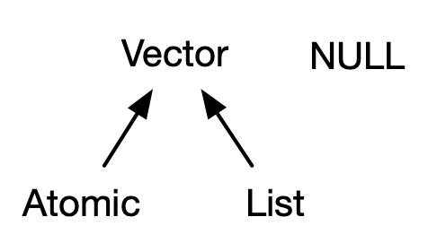

# Vectors

## Introduction

이 Chapter에서는 R의 기본 데이터 타입들 중 가장 중요한, 벡터에 대해 이야기하려 합니다. 아마 당신은 여러 종류의 벡터들을 이미 사용해왔겠지만, 아마 그것들이 서로 어떤 연관성이 있는지에 대해서는 깊게 생각해보지 않았을 겁니다. 이번 Chapter에서 모든 벡터 타입들을 너무 자세히 다루지는 않겠지만, 이 타입들이 전체적으로 어떻게 들어맞는지 보여드리겠습니다. 만약 더 자세히 알고 싶다면, R 문서를 찾아보시면 되겠습니다. 

벡터는 두가지 맛이 있는데, 원자(atomic) 벡터와 리스트입니다. 이들은 가지고 있는 원소 타입에 차이가 있는데, 원자 벡터는 모든 원소가 반드시 같은 타입이어야만 하고, 리스트는 다른 타입의 원소들을 가질 수 있습니다. 벡터는 아니지만, `NULL`도 벡터와 밀접히 관련되어 있고, 종종 길이가 0인 일반 벡터의 역할을 하기도 합니다. 이 다이어그램이  기본적인 관계들을 표현해주고 있습니다. Chapter가 진행됨에 따라 다이어그램을 확장해보겠습니다.

## Atomic vectors
## Attributes
## S3 atomic vectors
## Lists
## Data frames and tibbles
## NULL
## Quiz answers
